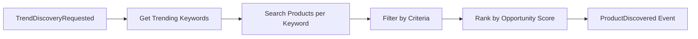
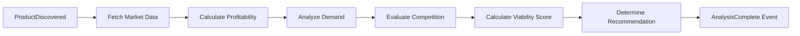
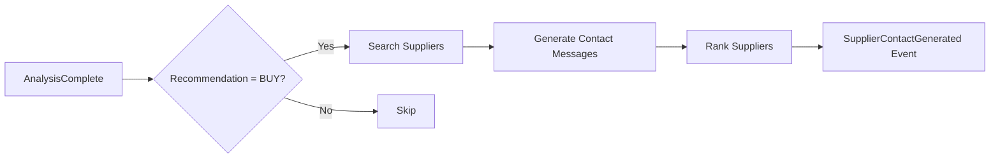
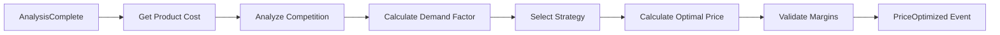
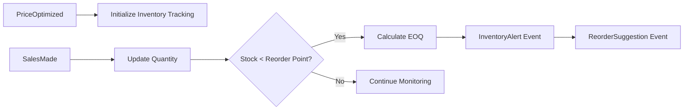
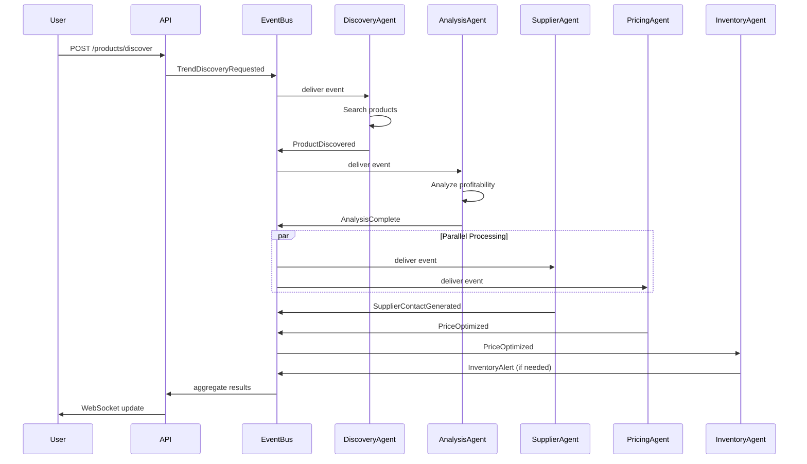

# 🤖 Amazon FBA AI Agent V2 - Agents Documentation

**Version:** 2.0.0  
**Architecture:** Event-Driven Multi-Agent System

---

## 📋 Table of Contents

1. [Overview](#overview)
2. [Agent Architecture](#agent-architecture)
3. [Discovery Agent](#discovery-agent)
4. [Analysis Agent](#analysis-agent)
5. [Supplier Agent](#supplier-agent)
6. [Pricing Agent](#pricing-agent)
7. [Inventory Agent](#inventory-agent)
8. [Event Flow](#event-flow)
9. [Configuration](#configuration)
10. [Monitoring & Metrics](#monitoring--metrics)
11. [Troubleshooting](#troubleshooting)

---

## 🎯 Overview

Amazon FBA AI Agent V2 uses an event-driven multi-agent architecture. Each agent is a specialized microservice that:

- ✅ Listens to specific events
- ✅ Performs specialized tasks
- ✅ Publishes events for other agents
- ✅ Scales independently
- ✅ Operates asynchronously

### Key Benefits

- **Scalability**: Each agent can scale independently based on load
- **Resilience**: Failure of one agent doesn't crash the system
- **Modularity**: Easy to add new agents or modify existing ones
- **Observability**: Each agent reports metrics independently
- **Testability**: Agents can be tested in isolation

---

## 🏗️ Agent Architecture

### Base Agent Class

All agents inherit from `BaseAgent`, which provides:

- ✅ Lifecycle management (start/stop)
- ✅ Event subscription handling
- ✅ Error handling and retry logic
- ✅ Metrics collection
- ✅ Health monitoring

### Agent States

```python
class AgentStatus(Enum):
    INITIALIZING = "initializing"  # Starting up
    READY = "ready"                # Ready to process events
    PROCESSING = "processing"     # Currently processing event
    ERROR = "error"                # Error state
    SHUTDOWN = "shutdown"          # Stopped
```

### Event Subscription Pattern

```python
class MyAgent(BaseAgent):
    def __init__(self):
        super().__init__(
            name="MyAgent",
            subscribed_events={"ProductDiscovered", "AnalysisComplete"}
        )
    
    async def process_event(self, event: Dict[str, Any]) -> Optional[Dict[str, Any]]:
        # Process event
        # Return new event(s) to publish, or None
        pass
```

---

## 🔍 Discovery Agent

### Purpose

Discovers profitable products using trending keywords and market analysis.

### Subscribed Events

- `TrendDiscoveryRequested` - Triggered when user requests product discovery

### Published Events

- `ProductDiscovered` - Emitted when viable products are found

### Configuration

```python
DiscoveryAgent(
    serpapi_key="your-key",      # SerpAPI key for Amazon searches
    cache_ttl=3600,              # Cache TTL (1 hour)
    min_rating=4.0,              # Minimum product rating
    max_price=5000               # Maximum product price
)
```

### Process Flow



### Example Usage

```python
from backend.agents.discovery_agent import DiscoveryAgent
from backend.core.event_bus import EventBus, Event

# Initialize
event_bus = EventBus(redis_url="redis://localhost:6379")
await event_bus.connect()

agent = DiscoveryAgent(serpapi_key="your-key")
await agent.start()

# Subscribe to event bus
await event_bus.subscribe("TrendDiscoveryRequested", agent.handle_event)

# Trigger discovery
event = Event(
    event_type="TrendDiscoveryRequested",
    payload={
        "budget": 3000,
        "category": "Sports",
        "keywords": ["yoga mat", "fitness"]
    }
)
await event_bus.publish(event)

# Agent will process and emit ProductDiscovered events
```

### Metrics

- `events_processed` - Total events processed
- `events_failed` - Failed events
- `avg_processing_time_ms` - Average processing time
- `products_discovered` - Products found
- `cache_hit_rate` - Cache efficiency

### Troubleshooting

**Problem:** No products discovered  
**Solution:** 
- Check SerpAPI key is valid
- Verify keywords are trending
- Check cache isn't stale
- Review filters (rating, price)

**Problem:** Slow discovery  
**Solution:**
- Increase cache TTL
- Reduce number of keywords searched
- Check Redis connectivity

---

## 📊 Analysis Agent

### Purpose

Analyzes product viability, profitability, and market conditions.

### Subscribed Events

- `ProductDiscovered` - When a new product is found

### Published Events

- `AnalysisComplete` - When analysis is finished

### Configuration

```python
AnalysisAgent(
    min_roi=30.0,                # Minimum ROI required (%)
    min_viability_score=70.0,    # Minimum viability score (0-100)
    cache_ttl=7200               # Cache TTL (2 hours)
)
```

### Analysis Components

1. **Profitability Analysis**
   - ROI calculation
   - Profit per unit
   - Monthly profit projection
   - FBA fees estimation
   - Shipping costs

2. **Demand Analysis**
   - Estimated monthly sales
   - Demand level (LOW/MEDIUM/HIGH)
   - Trend direction (declining/stable/growing)

3. **Competition Analysis**
   - Competition level
   - Number of sellers
   - Average competitor price
   - Price range

### Process Flow



### Example Usage

```python
from backend.agents.analysis_agent import AnalysisAgent

agent = AnalysisAgent(
    min_roi=30.0,
    min_viability_score=70.0
)
await agent.start()

# Will automatically process ProductDiscovered events
```

### Recommendations

- `BUY` - Product is viable, proceed
- `MONITOR` - Product has potential, monitor trends
- `SKIP` - Product not viable

### Metrics

- `analyses_completed` - Total analyses done
- `avg_viability_score` - Average viability score
- `buy_recommendations` - Number of BUY recommendations
- `analysis_duration_avg` - Average analysis time

### Troubleshooting

**Problem:** Analysis takes too long  
**Solution:**
- Check cache hit rate
- Optimize market data fetching
- Parallelize independent calculations

**Problem:** Low viability scores  
**Solution:**
- Review ROI thresholds
- Check market data accuracy
- Adjust scoring algorithm

---

## 🏭 Supplier Agent

### Purpose

Manages supplier search, contact, and communication tracking.

### Subscribed Events

- `AnalysisComplete` - When analysis recommends BUY

### Published Events

- `SupplierContactGenerated` - When supplier messages are created
- `SupplierResponseReceived` - When suppliers reply

### Configuration

```python
SupplierAgent(
    openai_api_key="sk-...",    # OpenAI API key for message generation
    cache_ttl=86400,            # Cache TTL (24 hours)
    max_suppliers=5             # Max suppliers to contact
)
```

### Features

- ✅ AI-powered message generation using OpenAI
- ✅ Template-based fallback if OpenAI unavailable
- ✅ Communication history tracking
- ✅ Supplier comparison and ranking
- ✅ Quote request automation

### Process Flow



### Message Generation

The agent uses OpenAI GPT to generate personalized supplier messages:

```python
# Example generated message
"""
Dear Supplier,

We are interested in purchasing [PRODUCT_NAME] for our Amazon FBA business.

Quantity: 100 units
Target Price: $12.50 per unit
Delivery: [LOCATION]
Custom Branding: Yes

Please provide:
- Unit price
- Minimum order quantity
- Lead time
- Payment terms
- Product samples availability

Thank you,
[YOUR_NAME]
"""
```

### Metrics

- `suppliers_contacted` - Total suppliers contacted
- `messages_generated` - Messages created
- `response_rate` - Supplier response rate
- `avg_quote_time` - Time to receive quotes

### Troubleshooting

**Problem:** No suppliers found  
**Solution:**
- Check supplier database connectivity
- Verify search criteria aren't too restrictive
- Review supplier data sources

**Problem:** Messages not generated  
**Solution:**
- Verify OpenAI API key is valid
- Check OpenAI quota/rate limits
- Fallback to templates should work

**Problem:** Low response rate  
**Solution:**
- Improve message personalization
- Optimize message timing
- Follow up with reminders

---

## 💰 Pricing Agent

### Purpose

Optimizes product pricing strategies to maximize ROI.

### Subscribed Events

- `AnalysisComplete` - When analysis is done

### Published Events

- `PriceOptimized` - When optimal price is calculated

### Configuration

```python
PricingAgent(
    target_roi=30.0,            # Target ROI (%)
    min_margin=20.0,            # Minimum margin (%)
    cache_ttl=3600              # Cache TTL (1 hour)
)
```

### Pricing Strategies

1. **Cost-Plus Pricing**
   - Base: Unit cost + fixed margin
   - Formula: `Price = Cost × (1 + Margin%)`

2. **Competitive Pricing**
   - Base: Competitor average price
   - Formula: `Price = Avg(Competitor Prices) ± Adjustment`

3. **Value-Based Pricing**
   - Base: Perceived value
   - Formula: `Price = Value × Value_Multiplier`

4. **Dynamic Pricing**
   - Base: Demand and supply
   - Formula: `Price = Base × Demand_Factor × Supply_Factor`

### Process Flow



### Example Usage

```python
from backend.agents.pricing_agent import PricingAgent

agent = PricingAgent(
    target_roi=30.0,
    min_margin=20.0
)
await agent.start()

# Processes AnalysisComplete events automatically
```

### Price Optimization Output

```json
{
  "asin": "B08N5WRWNW",
  "old_price": 34.99,
  "new_price": 36.99,
  "expected_profit": 15.50,
  "roi_improvement": 8.5,
  "strategy": "competitive",
  "confidence": 78.5,
  "reasoning": "Competitors increased prices, demand stable"
}
```

### Metrics

- `prices_optimized` - Total optimizations
- `avg_roi_improvement` - Average ROI improvement
- `strategy_distribution` - Strategy usage stats
- `price_change_frequency` - How often prices change

### Troubleshooting

**Problem:** Prices too high/low  
**Solution:**
- Adjust target ROI
- Review competition data
- Check demand factors

**Problem:** Frequent price changes  
**Solution:**
- Increase minimum change threshold
- Add price change cooldown
- Stabilize demand factors

---

## 📦 Inventory Agent

### Purpose

Tracks inventory levels and generates reorder alerts.

### Subscribed Events

- `PriceOptimized` - When product is ready to sell
- `SalesMade` - When sales occur
- `InventoryUpdate` - Manual inventory updates

### Published Events

- `InventoryAlert` - When stock is low
- `ReorderSuggestion` - When reorder is recommended

### Configuration

```python
InventoryAgent(
    low_stock_threshold=50,     # Low stock alert threshold
    reorder_point=30,           # Reorder trigger point
    lead_time_days=30,          # Supplier lead time
    cache_ttl=3600              # Cache TTL (1 hour)
)
```

### Features

- ✅ Real-time inventory tracking
- ✅ Stockout prediction
- ✅ EOQ (Economic Order Quantity) optimization
- ✅ Automatic alert generation
- ✅ Multi-location support

### Process Flow



### Inventory States

- `IN_STOCK` - Sufficient stock
- `LOW_STOCK` - Below threshold
- `OUT_OF_STOCK` - Zero inventory
- `REORDERING` - Order placed
- `OVERSTOCK` - Too much inventory

### Alert Levels

- `low` - Stock approaching reorder point
- `medium` - Stock at reorder point
- `high` - Stock below reorder point
- `critical` - Stockout imminent

### Example Usage

```python
from backend.agents.inventory_agent import InventoryAgent

agent = InventoryAgent(
    low_stock_threshold=50,
    reorder_point=30,
    lead_time_days=30
)
await agent.start()

# Tracks inventory automatically
```

### EOQ Calculation

Economic Order Quantity formula:

```
EOQ = √(2 × Demand × Order_Cost / Holding_Cost)
```

### Metrics

- `inventory_alerts` - Total alerts generated
- `avg_days_until_stockout` - Prediction accuracy
- `reorder_suggestions` - Reorders recommended
- `stockout_events` - Stockouts prevented

### Troubleshooting

**Problem:** False alerts  
**Solution:**
- Adjust reorder point
- Improve demand forecasting
- Review lead time accuracy

**Problem:** Overstocking  
**Solution:**
- Optimize EOQ formula
- Review demand predictions
- Adjust holding costs

**Problem:** Stockouts  
**Solution:**
- Lower reorder point
- Increase safety stock
- Reduce lead time

---

## 🔄 Event Flow

### Complete Pipeline Flow



### Event Types Reference

| Event Type | Source Agent | Trigger | Payload |
|------------|--------------|---------|---------|
| `TrendDiscoveryRequested` | API Gateway | User request | `budget`, `categories` |
| `ProductDiscovered` | DiscoveryAgent | Products found | `product`, `opportunity_score` |
| `AnalysisComplete` | AnalysisAgent | Analysis done | `analysis`, `recommendation` |
| `SupplierContactGenerated` | SupplierAgent | Messages created | `suppliers`, `messages` |
| `PriceOptimized` | PricingAgent | Price calculated | `old_price`, `new_price` |
| `InventoryAlert` | InventoryAgent | Low stock | `quantity`, `urgency` |

---

## ⚙️ Configuration

### Environment Variables

```bash
# Redis (Event Bus)
REDIS_HOST=localhost
REDIS_PORT=6379
REDIS_PASSWORD=

# External APIs
SERPAPI_KEY=your-serpapi-key
OPENAI_API_KEY=sk-your-openai-key

# Agent Configuration
AGENT_DISCOVERY_ENABLED=true
AGENT_ANALYSIS_ENABLED=true
AGENT_SUPPLIER_ENABLED=true
AGENT_PRICING_ENABLED=true
AGENT_INVENTORY_ENABLED=true

# Logging
LOG_LEVEL=INFO
```

### Agent-Specific Configuration

Each agent can be configured via constructor parameters or environment variables:

```python
# Discovery Agent
DISCOVERY_MIN_RATING=4.0
DISCOVERY_MAX_PRICE=5000
DISCOVERY_CACHE_TTL=3600

# Analysis Agent
ANALYSIS_MIN_ROI=30.0
ANALYSIS_MIN_VIABILITY=70.0

# Supplier Agent
SUPPLIER_MAX_SUPPLIERS=5
SUPPLIER_CACHE_TTL=86400

# Pricing Agent
PRICING_TARGET_ROI=30.0
PRICING_MIN_MARGIN=20.0

# Inventory Agent
INVENTORY_LOW_STOCK_THRESHOLD=50
INVENTORY_REORDER_POINT=30
INVENTORY_LEAD_TIME_DAYS=30
```

---

## 📊 Monitoring & Metrics

### Agent Metrics

Each agent exposes metrics via `get_metrics()`:

```python
metrics = agent.get_metrics()
# Returns:
{
    "name": "DiscoveryAgent",
    "status": "ready",
    "subscribed_events": ["TrendDiscoveryRequested"],
    "metrics": {
        "events_processed": 150,
        "events_failed": 2,
        "avg_processing_time_ms": 1250.5,
        "success_rate": 98.68,
        "last_event_time": "2025-10-29T10:00:00Z"
    }
}
```

### Prometheus Metrics

All agents expose Prometheus metrics:

- `agent_events_processed_total` - Total events processed
- `agent_events_failed_total` - Total failures
- `agent_processing_time_seconds` - Processing duration histogram
- `agent_status` - Current agent status (0/1)

### Health Checks

```http
GET /api/v2/health
```

Returns agent status:

```json
{
  "status": "healthy",
  "agents": {
    "discovery": {
      "status": "ready",
      "healthy": true,
      "events_processed": 150
    },
    "analysis": {
      "status": "ready",
      "healthy": true,
      "events_processed": 120
    }
  }
}
```

---

## 🔧 Troubleshooting

### Common Issues

#### Agent Not Processing Events

**Symptoms:**
- Events published but not processed
- Agent status shows "ready" but no activity

**Solutions:**
1. Check event subscription:
   ```python
   print(agent.subscribed_events)  # Should include event type
   ```

2. Verify Event Bus connection:
   ```python
   print(event_bus.connected)  # Should be True
   ```

3. Check Redis connectivity:
   ```bash
   redis-cli ping  # Should return PONG
   ```

#### Agent Stuck in ERROR State

**Symptoms:**
- Agent status is "error"
- No events being processed

**Solutions:**
1. Check logs for error details:
   ```python
   agent.logger.error(...)  # Review error messages
   ```

2. Restart agent:
   ```python
   await agent.stop()
   await agent.start()
   ```

3. Check dependencies (Redis, APIs, Database)

#### High Event Processing Time

**Symptoms:**
- `avg_processing_time_ms` is high
- Slow system response

**Solutions:**
1. Enable caching:
   ```python
   agent.cache_ttl = 7200  # Increase TTL
   ```

2. Optimize event processing logic
3. Scale agent horizontally (add more instances)

#### Memory Leaks

**Symptoms:**
- Agent memory usage increasing over time
- System slowdown

**Solutions:**
1. Check for unbounded data structures
2. Clear cache periodically
3. Implement connection pooling

### Debug Mode

Enable debug logging:

```python
import logging
logging.basicConfig(level=logging.DEBUG)

# Or for specific agent
agent.logger.setLevel(logging.DEBUG)
```

### Testing Agents

```python
import asyncio
from backend.agents.discovery_agent import DiscoveryAgent

async def test_agent():
    agent = DiscoveryAgent()
    await agent.start()
    
    # Test event
    event = {
        "event_type": "TrendDiscoveryRequested",
        "payload": {"budget": 1000, "category": "Sports"},
        "event_id": "test-123",
        "timestamp": "2025-10-29T10:00:00Z"
    }
    
    result = await agent.process_event(event)
    print(f"Result: {result}")
    
    await agent.stop()

asyncio.run(test_agent())
```

---

## 🔗 Related Documentation

- [API.md](./API.md) - REST API documentation
- [ARCHITECTURE_V2.md](./ARCHITECTURE_V2.md) - System architecture
- [DEPLOYMENT.md](./DEPLOYMENT.md) - Deployment guide

---

## 📝 Version History

- **v2.0.0** (2025-10-29) - Initial release with 5 agents

---

## 🆘 Support

For agent-specific issues:
- Check logs: `logs/agents/{agent_name}.log`
- Review metrics: `/api/v2/metrics`
- GitHub Issues: [Link]

